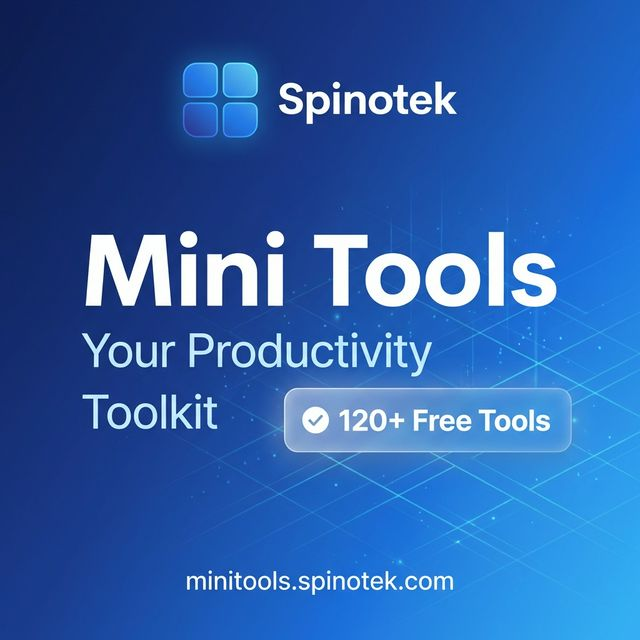

<p align="center">
  
</p>

<h1 align="center">Mini Tools by Spinotek</h1>

<p align="center">
  <strong>Your Productivity Toolkit. All in One Place.</strong><br/>
  120+ browser-based productivity tools for developers, creators, and professionals.
</p>

<p align="center">
  <a href="https://minitools.spinotek.com">🌐 Live Demo</a> •
  <a href="#features">✨ Features</a> •
  <a href="#contributing">🤝 Contributing</a> •
  <a href="#license">📄 License</a>
</p>

<p align="center">
  
  
  
  
</p>

---

## 🚀 About

**Mini Tools** is an official platform by [Spinotek](https://spinotek.com) — a Software Development Company. This project provides a comprehensive collection of free, browser-based productivity tools designed for:

- 👨‍💻 **Developers** — Code formatters, converters, encoders, regex testers
- 🎨 **Creators** — Color tools, image utilities, text generators
- 💼 **Professionals** — Business calculators, invoice generators, document tools

**Zero friction. Instant results. No sign-up required.**

---

## ✨ Features

- ⚡ **120+ Tools** across 10+ categories
- 🔒 **Privacy-first** — All processing happens in your browser
- 📱 **Responsive** — Works on desktop, tablet, and mobile
- 🎨 **Modern UI** — Clean, professional design with dark mode support
- 🆓 **100% Free** — No hidden costs or premium tiers
- 🌐 **Open Source** — Contribute and extend!

---

## 📁 Project Structure

```
tools-spinotek/
├── docs/
│   ├── LIST_TOOLS.md           # Master list of all tools
│   └── implementation/         # Implementation plans per category
│       ├── dev.md
│       ├── office.md
│       ├── business.md
│       └── ...
├── public/
├── src/
│   ├── components/
│   │   ├── shared/             # Reusable components
│   │   └── home/               # Homepage components
│   ├── data/
│   │   ├── toolsList.js        # Tool definitions
│   │   └── categories.js       # Category definitions
│   ├── pages/
│   │   └── tools/              # Tool pages by category
│   └── App.jsx                 # Main routing
└── README.md
```

---

## 🛠️ Getting Started

### Prerequisites

- Node.js 18+
- npm or yarn

### Installation

```bash
# Clone the repository
git clone https://github.com/Spinotek-Organization/minitools.git

# Navigate to project
cd tools-spinotek

# Install dependencies
npm install

# Start development server
npm run dev
```

The app will be available at `http://localhost:5173`

---

## 🤝 Contributing

We welcome contributions! Here's how you can help:

### Adding a New Tool to an Existing Category

1. **Update the implementation plan** in `docs/implementation/{category}.md`
2. **Add the tool to** `docs/LIST_TOOLS.md`
3. **Register the tool** in `src/data/toolsList.js`
4. **Create the component** in `src/pages/tools/{category}/YourTool.jsx`
5. **Add the route** in `src/App.jsx`

### Adding a New Category

1. **Add category to** `docs/LIST_TOOLS.md`
2. **Create implementation plan** in `docs/implementation/{new-category}.md`
3. **Register category** in `src/data/categories.js`
4. **Add tools** following the steps above

### Contribution Workflow

```bash
# Fork the repository
# Create your feature branch
git checkout -b feature/amazing-tool

# Make your changes
# Commit your changes
git commit -m 'Add amazing tool'

# Push to the branch
git push origin feature/amazing-tool

# Open a Pull Request
```

### Code Style

- Use **React functional components** with hooks
- Follow existing **component patterns** (check existing tools for reference)
- Use **Tailwind CSS** for styling
- Include **Helmet** meta tags for SEO
- Add **RelatedTools** component at the bottom

---

## 📋 Tool Template

Here's a basic template for creating a new tool:

```jsx
import React, { useState } from 'react';
import { Helmet } from 'react-helmet-async';
import { YourIcon } from 'lucide-react';
import ToolPageLayout from '../../../components/shared/ToolPageLayout';
import RelatedTools from '../../../components/shared/RelatedTools';

export default function YourToolName() {
    const [input, setInput] = useState('');
    const [output, setOutput] = useState('');

    const handleProcess = () => {
        // Your tool logic here
    };

    return (
        <ToolPageLayout>
            <Helmet>
                <title>Your Tool Name | Mini Tools by Spinotek</title>
                <meta name="description" content="Tool description here." />
            </Helmet>

            {/* Tool Header */}
            <div className="flex items-center gap-4 mb-8">
                <div className="w-12 h-12 bg-blue-600 rounded-2xl flex items-center justify-center text-white">
                    <YourIcon size={24} />
                </div>
                <div>
                    <h1 className="text-2xl font-black text-slate-900">Your Tool Name</h1>
                    <p className="text-slate-500">Brief description of what the tool does.</p>
                </div>
            </div>

            {/* Tool Content */}
            <div className="bg-white rounded-3xl border border-slate-100 p-8">
                {/* Your tool UI here */}
            </div>

            <RelatedTools currentToolId="your-tool-id" categoryId="your-category" />
        </ToolPageLayout>
    );
}
```

---

## 📄 License

This project is licensed under the **MIT License** — see the [LICENSE](LICENSE) file for details.

---

## 🏢 About Spinotek

<p align="center">
  <a href="https://spinotek.com">
    
  </a>
</p>

**Spinotek** is a software development company specializing in high-performance web and mobile applications. We help businesses build digital products that scale.

- 🌐 [spinotek.com](https://spinotek.com)
- 📧 [hello@spinotek.com](mailto:hello@spinotek.com)
- 💼 [LinkedIn](https://www.linkedin.com/company/spinotek-corp/)
- 📸 [Instagram](https://www.instagram.com/spinotekcorp/)

---

<p align="center">
  Made with ❤️ by <a href="https://spinotek.com">Spinotek</a>
</p>
